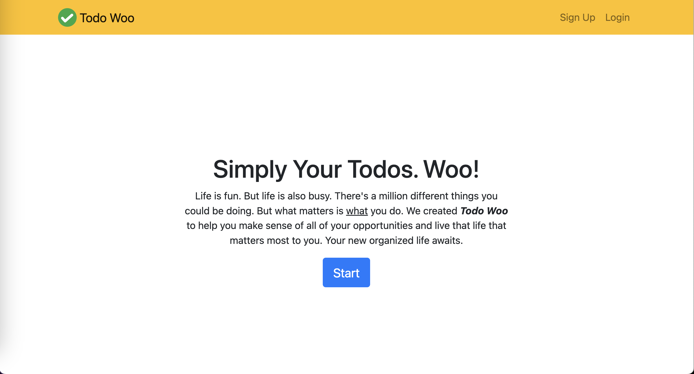
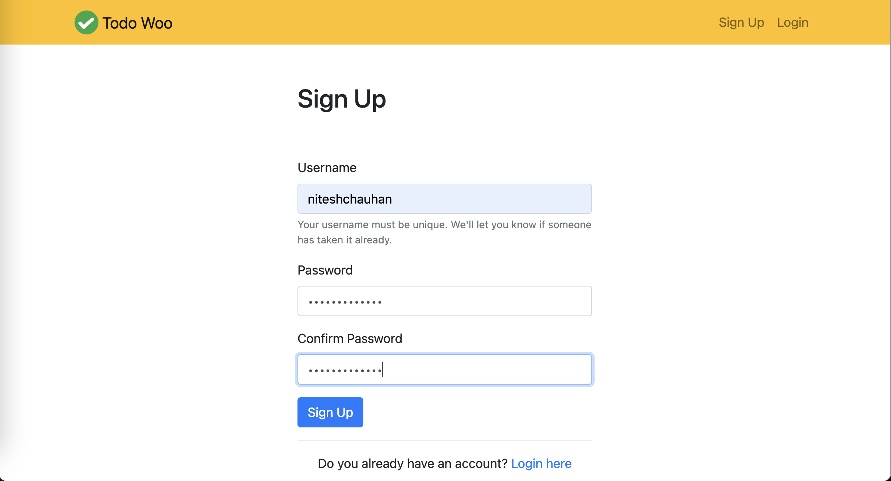
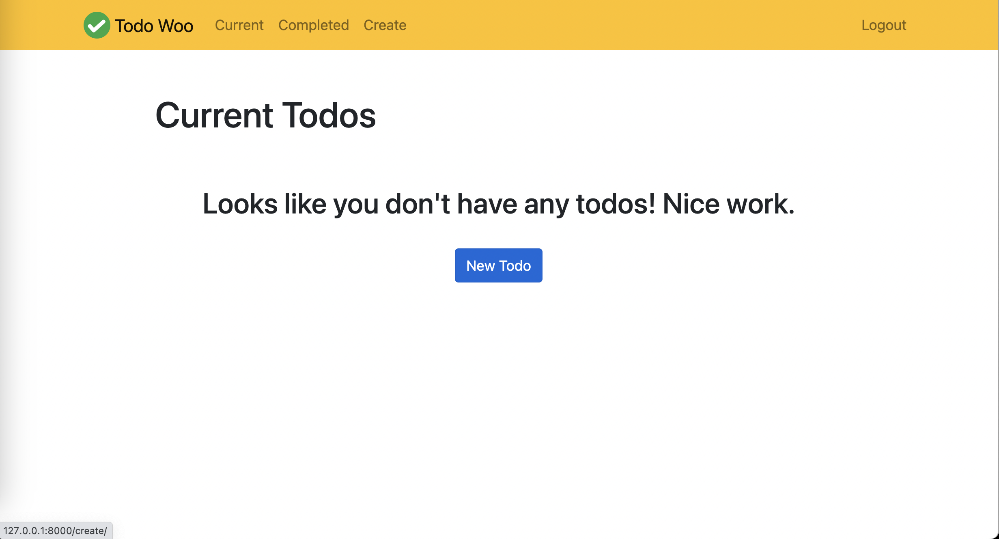
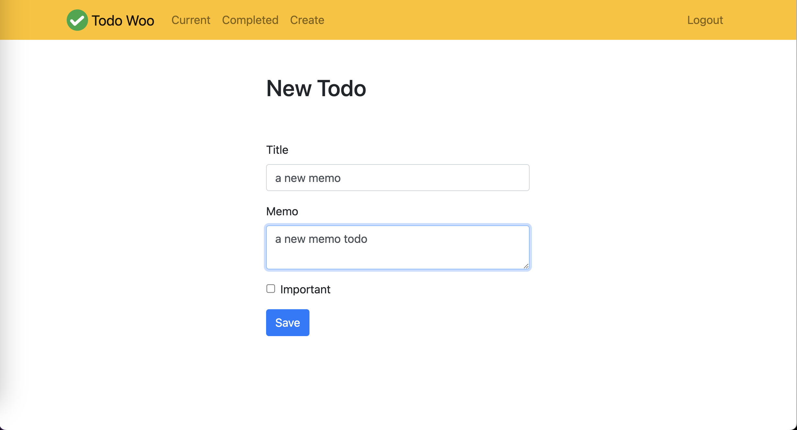
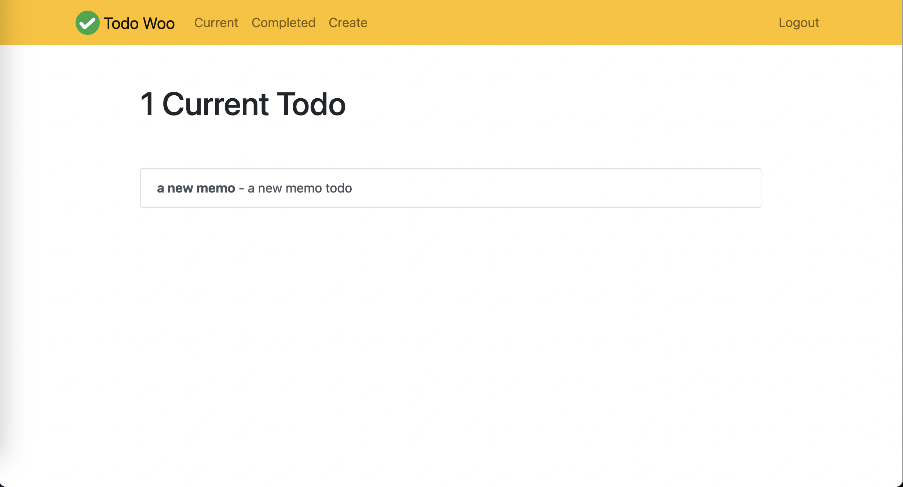
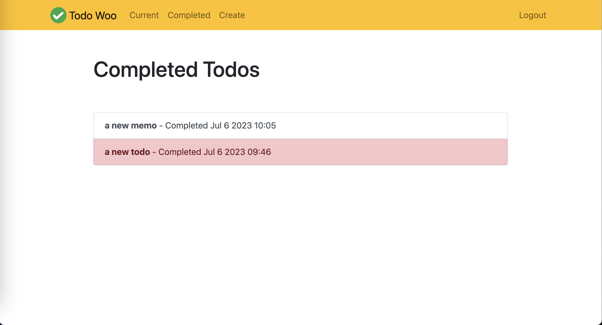

# todo-django

**todo-django** is a simple To-Do application built using Django 3 and SQLite, designed to help you manage your tasks efficiently.

## Features

- Create, read, update, and delete tasks.
- User-friendly interface for managing your to-do list.
- Powered by Django, a robust and popular web framework.

## How to Run

Follow these steps to set up and run the application locally:

1. Create a virtual environment:

   ```shell
   python -m venv venv
   ```

2. Activate the virtual environment:

   ```shell
   source venv/bin/activate
   ```

3. Install project dependencies from the `requirements.txt` file:

   ```shell
   pip install -r requirements.txt
   ```

4. Apply database migrations:

   ```shell
   python manage.py migrate
   ```

5. Start the development server:

   ```shell
   python manage.py runserver
   ```

6. Open your web browser and visit `http://localhost:8000` to access the To-Do app.

## Screenshots

Explore the application with these screenshots:













## Usage

- Use this To-Do app to create, manage, and organize your tasks.
- Easily mark tasks as completed or remove them when you're done.

## Contributions

Contributions are welcome! If you have any enhancements or feature additions in mind, feel free to submit a pull request.

## License

This project is open-source and available under the [MIT License](LICENSE). You are free to use and modify the application as needed.

Enjoy staying organized with todo-django!
